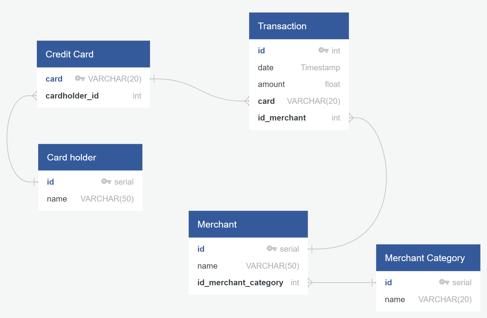

# Looking for Suspicious Transactions

## Data Modeling

### Entity Relationship Diagram (ERD)

As the first step, an Entity Relationship Diagram (ERD) was created to model the relationships among the data. This step enables to visualize the structure of the database and define the tables and relationships necessary for the analysis. The ERD helped us plan and design the database schema effectively. 

### Database Schema

A database schema is then created where data types, primary keys, foreign keys, and other constraints are specified. This ensures that the data would be organized and stored correctly in the database. After defining the schema, the data is imported from the provided CSV files into the respective tables. 

## Data Analysis (Part 1)

### Cardholder Transaction Analysis

**Query 1: Grouping Transactions by Cardholder and Counting Small Transactions**

An SQL query that grouped transactions by the Card holder ID with the both transactions count and the total amount for the transactions in the cases where the transactions were lesser than $2.0 were created. The minimum and maximum transaction dates were also set-up as columns for additional understanding of cases where (if or not) the transactions where continuous in a give timeframe.

The resulting dataframe is printed in the Python notebook (visual_data_analysis.pynb), the SQL query can be obtained from the query.sql file.

**Query 2: Analyzing Transactions by Time Period**

The next goal was to determine the occurences of high amount transactions between 7am to 9am and compare it to the rest of the day. The top 100 transactions were queried and it is easy to flag transactions by the same cardholders are odd times around the day using this method. 

Based on the two queries generated one can analyze the retrieved transactions for potential anomalies. The idea is to look for unusually high transaction amounts or patterns that might suggest fraudulent activity especially paying attention to the cardholder names and transaction dates.

Possible explanations might include the fact that fraudsters might target a certain time frame by merchants when cardholders are less likely to notice abnormal transactions, or it could be coincidental. Further investigation may be needed to confirm any suspicions of fraudulent activity.

The resulting dataframe is printed in the Python notebook (visual_data_analysis.pynb), the SQL query can also be obtained from the query.sql file.

**Query 3: Identifying High-Risk Merchants**

To further enhance the fraud detection efforts, the top 5 merchants prone to being hacked using small transactions were queried. 

The resulting dataframe is printed in the Python notebook (visual_data_analysis.pynb), the SQL query can also be obtained from the query.sql file.

## Data Analysis (Part 2)

### Cardholder Trends Analysis

**The Two Important Customers (Cardholder IDs 2 and 18)**

To address the CFO's concern about potential fraud involving two significant customers with cardholder IDs 2 and 18 plots were created to visually represent their transaction patterns showing the time series of transactions for each cardholder. A combined/merged plot was created to understand the anomalies for the card holders.

- Cardholder 2:
    

- Cardholder 18:
    

- Combined Trends:
    

The data shows that card holder 18 has various offset transactions (over $1000.0) which are possible discrepancies and can be flagged as fraud.

The resulting dataframe is printed in the Python notebook (visual_data_analysis.pynb), the SQL query can also be obtained from the query.sql file.

**The CEO's Corporate Credit Card (Cardholder ID 25)**

To understand if the Card holder 25 had suspecting transactions a hvPlot was used to create a box plot representing expenditure data from January 2018 to June 2018. The analysis delineates if there were any outliers and if anomalies existed. 

- Cardholder 25 Box Plot:
    

The analysis indicated that, although the majority of transactions of Card holder-25 are of small amounts, every month there is big spending over $1000.

To further analyze the underlying cause, the merchant and time of transactions can be cross checked by ussing joins in the query.

The resulting dataframe is printed in the Python notebook (visual_data_analysis.pynb), the SQL query can also be obtained from the query.sql file.

## Challenge

**Identifying Anomalies Using Standard Deviation and IQR**

In addition to the above analysis, two Python functions were introduced to identify anomalies:

1. `identify_anomalies_std_dev`: This function uses standard deviation to identify anomalies for any cardholder.

2. `identify_anomalies_iqr`: This function uses the interquartile range (IQR) to identify anomalies for any cardholder.

The results of these functions provide another layer of fraud detection based on outlier detection techniques.